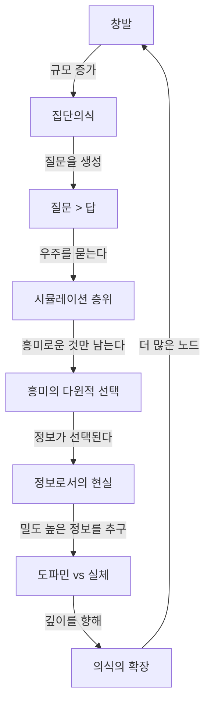

# 알고리즘 아트 씨앗 — 머스크 인터뷰에서 추출한 철학적 에센스

> [!quote] 인터뷰의 핵심 질문
> *"What is going on in this reality? Is this reality?"*

---

## 씨앗 1 — 창발 (Emergence)

> *"30~40조 개의 세포가 모여 인간이 된다. 박테리아는 로켓을 못 만들지만 인간은 만든다. 그리고 인간이 모이면 또 다른 무언가가 생겨난다."*

**철학적 핵심:** 단순한 단위들의 합이 질적으로 전혀 다른 수준을 창발한다. 단순함 → 복잡함 → 또 다른 단순함(의식).

**알고리즘 번역:**
- 규칙: 로컬 규칙만 존재, 전역 설계 없음
- 스케일 전환 시 새로운 패턴이 나타남
- 파라미터: `particleCount`, `localRadius`, `emergenceThreshold`

```
세포 오토마타 / 스웜 / Boids / 반응-확산계
```

---

## 씨앗 2 — 중첩된 시뮬레이션 (Nested Simulations)

> *"시뮬레이션 안에 시뮬레이션, 그 안에 또 시뮬레이션. 몇 겹인지 알 수 없다."*
> *"비디오 게임은 Pong(사각형 두 개)에서 포토리얼리스틱으로 발전했다. 단 50년 만에."*

**철학적 핵심:** 현실은 재귀적이다. 어떤 수준에서 보느냐에 따라 완전히 다른 세계가 보인다. 관찰자는 자신이 어느 층위에 있는지 알 수 없다.

**알고리즘 번역:**
- 재귀 함수가 자기 자신을 그린다
- 줌인할수록 동일한 구조가 반복
- 파라미터: `depth`, `scaleFactor`, `noiseOctaves`

```
프랙탈 / L-시스템 / Mandelbrot / 재귀 트리
```

---

## 씨앗 3 — 흥미로운 것이 살아남는다 (Survival of the Interesting)

> *"지루한 시뮬레이션은 중단된다. 우리가 존재한다는 것은 우리의 현실이 충분히 흥미롭다는 증거다."*
> *"Tesla가 자율주행 데이터를 모을 때, 맑은 날 직선 도로는 필요 없다. 이상한 것, 극단적인 것이 필요하다."*

**철학적 핵심:** 가장 흥미로운 결과가 가장 가능성 높은 결과다. 평범함은 선택받지 못한다. 생존 자체가 흥미로움의 증명이다.

**알고리즘 번역:**
- 진화적 알고리즘: 지루한 개체는 도태
- "흥미로움" 함수 = 예측 불가능성 + 복잡도의 균형
- 파라미터: `mutationRate`, `fitnessFunc`, `generationCount`

```
유전 알고리즘 / 카오스 끌개 / 이상한 끌개(Strange Attractor)
```

---

## 씨앗 4 — 질문이 답보다 크다 (The Question > The Answer)

> *"Hitchhiker's Guide to the Galaxy에서 지구는 42라는 답을 계산했다. 하지만 더 어려운 것은 질문이다. 질문을 위해서는 지구보다 훨씬 큰 컴퓨터가 필요하다."*
> *"우리가 아직 묻지 못한 질문들이 가장 중요한 질문들일 것이다."*

**철학적 핵심:** 중심에 답이 있지만, 답에 이르는 올바른 질문을 찾는 여정이 더 광대하다. 도달하려 하지만 닿을 수 없는 구조.

**알고리즘 번역:**
- 중심을 향해 나선형으로 수렴하지만 결코 닿지 않음
- 또는 중심에서 바깥으로 퍼지되 경계가 사라지는 구조
- 파라미터: `convergenceRate`, `asymptote`, `spiralTightness`

```
황금비 나선 / Zeno 역설 시각화 / 점근 곡선 / 로그 나선
```

---

## 씨앗 5 — 집단의식 (Collective Consciousness)

> *"X는 글로벌 타운 스퀘어다. 집단 의식에 가능한 한 가깝게 가고 싶다."*
> *"언어별로 분리된 의식이 아니라, 자동 번역을 통해 모든 언어 그룹의 생각이 하나의 흐름으로."*

**철학적 핵심:** 개별 노드들의 연결이 어느 임계점을 넘으면, 단순한 네트워크가 아닌 '마음'이 된다. 연결의 질이 집단 지성의 깊이를 결정한다.

**알고리즘 번역:**
- 노드들이 서로 끌어당기고 밀어내며 배열됨
- 연결이 강할수록 시각적으로 굵고 밝아짐
- 임계 연결 수에서 갑작스러운 패턴 변화
- 파라미터: `nodeCount`, `connectionStrength`, `thresholdDensity`

```
포스-다이렉티드 그래프 / 신경망 시각화 / 셀룰러 오토마타
```

---

## 씨앗 6 — 정보로서의 현실 (Reality as Information)

> *"돈은 노동 할당을 위한 정보 시스템이다. 노동이 없으면 돈은 의미 없다. 무인도에서 조 달러는 쓸모없다."*
> *"텍스트는 비디오보다 정보 밀도가 높다. 압축된 정보다."*

**철학적 핵심:** 모든 것은 정보다. 물질도, 에너지도, 화폐도 — 결국 신호와 노이즈의 패턴. 밀도와 압축이 가치를 만든다.

**알고리즘 번역:**
- 엔트로피 시각화: 질서(낮은 엔트로피) ↔ 혼돈(높은 엔트로피)
- 정보 밀도에 따른 색상/밀도 맵핑
- 파라미터: `entropy`, `compressionRatio`, `signalToNoise`

```
노이즈 필드 / Voronoi / 반응-확산 / 정보 시각화
```

---

## 씨앗 7 — 도파민 vs 실체 (Instant Hit vs Dense Meaning)

> *"도파민 히트를 연속으로 주는 영상 스트림은 뇌를 썩게 한다(brain rot). 실질 없는 자극은 좋은 시간 사용이 아니다."*
> *"반면 텍스트는 느리지만 더 밀도 높은 정보다."*

**철학적 핵심:** 두 가지 흐름의 영원한 긴장 — 빠르고 강렬한 자극 vs 느리고 깊은 이해. 표면과 심층.

**알고리즘 번역:**
- 두 레이어: 빠른 노이즈 레이어(표면) + 느린 구조 레이어(심층)
- 시간이 지남에 따라 심층 레이어가 드러남
- 파라미터: `surfaceSpeed`, `depthSpeed`, `layerOpacity`, `time`

```
레이어드 Perlin 노이즈 / 시간 기반 드러남 / 대비 애니메이션
```

---

## 씨앗 8 — 의식의 확장 (Expanding Consciousness)

> *"의식의 범위와 규모를 늘릴수록 우주를 이해할 가능성이 높아진다. 줄이면 줄일수록 이해 가능성이 낮아진다."*
> *"다행성 종족이 되는 것, 우주로 나가는 것 — 이것은 의식의 확장이다."*

**철학적 핵심:** 확장은 생존이자 이해의 조건이다. 내부에서만 맴도는 의식은 결국 소멸한다. 바깥으로 나가는 것이 깊어지는 것이다.

**알고리즘 번역:**
- 중심에서 바깥으로 지속적으로 퍼지는 파동
- 경계에 닿으면 새로운 중심을 만들어 다시 퍼짐
- 파라미터: `expansionRate`, `waveDecay`, `newCenterProbability`

```
동심원 파동 / 파동 간섭 / 세포 분열 시뮬레이션
```

---

## 씨앗들의 관계



---

## 조합 실험 제안

> [!tip] 가장 강력한 조합
> **씨앗 2 × 씨앗 3** — *중첩된 시뮬레이션 + 흥미의 선택*
> 프랙탈의 각 레벨에서 "흥미로운" 분기만 살아남아 성장. 나머지는 회색으로 소멸.

> [!tip] 가장 서정적인 조합
> **씨앗 4 × 씨앗 8** — *질문 > 답 + 의식의 확장*
> 중심을 향해 나선형으로 수렴하는 파동이 동시에 바깥으로 퍼짐. 안과 밖이 동시에.

> [!tip] 가장 사회적인 조합
> **씨앗 1 × 씨앗 5** — *창발 + 집단의식*
> 개별 입자들이 로컬 규칙으로 움직이다가, 특정 밀도에서 갑자기 하나의 흐름이 됨.
